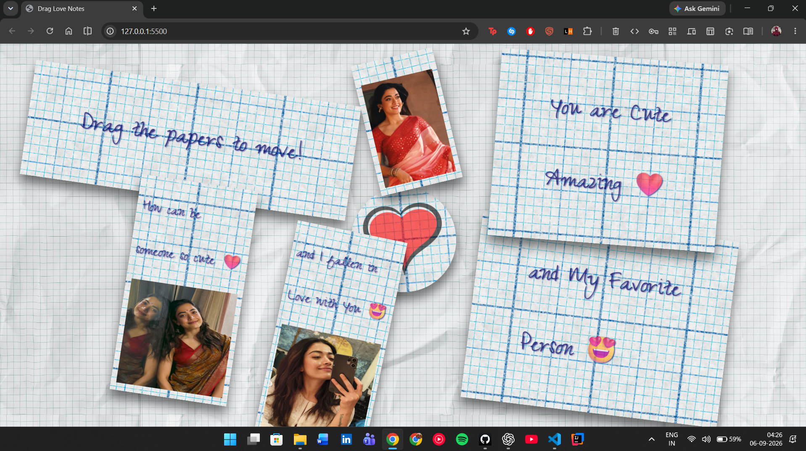

<div align="center">

# 💌 Drag Love Notes

### *A tiny desk full of notes, feelings, and a little bit of JavaScript.*

<a href="https://pr1thviraj-cs.github.io/Drag-Love-Notes/"></a>
&nbsp;
<a href="https://github.com/pr1thviiraj-cs/Drag-Love-Notes"></a>

<br />
<br />

`HTML` &nbsp;·&nbsp; `CSS` &nbsp;·&nbsp; `Vanilla JavaScript` &nbsp;·&nbsp; `Touch friendly`

</div>

---

<div align="center">
  <i>Drag the papers. Rearrange the moment. Make the screen yours.</i>
</div>

**Drag Love Notes** is a playful, interactive frontend experience inspired by handwritten notes scattered across a desk. Every paper can be picked up and moved freely; each starts with a gentle random tilt and rises to the front when selected.

<div align="center">
  <br />
  
  &nbsp;
  
  &nbsp;
  <sub>Original image assets used inside the draggable note layout.</sub>
</div>

## ✦ What makes it fun?

| 📝 Move it | 🌸 Make it feel real | 📱 Take it anywhere |
| :---: | :---: | :---: |
| Freely drag the notes around the screen. | Random rotation makes the papers feel naturally placed. | Built for mouse and touch interactions. |
| Active notes come forward automatically. | Handwritten type and paper textures set the mood. | Lightweight and framework-free. |

## ✦ Take a look

<div align="center">
  <a href="https://pr1thviraj-cs.github.io/Drag-Love-Notes/"></a>
</div>

## ✦ Built with

| Layer | Role |
| --- | --- |
| **HTML5** | Structures the notes, photo cards, and page content. |
| **CSS3** | Creates the paper texture, handwritten aesthetic, layout, and responsive presentation. |
| **Vanilla JavaScript** | Handles dragging, touch input, note translation, rotation, and `z-index` layering. |

## ✦ How the interaction works

```text
Pick a note  →  Move with mouse / touch  →  Note follows your movement  →  Release anywhere
       │                         │
       └──── selected note is raised above every other paper ────┘
```

Each movable note receives its own `Paper` instance. When a drag begins, the page records the starting point, increases the active note’s stacking order, and updates its CSS `transform` while it moves.

## ✦ Made for every screen

<div align="center">

| 💻 Desktop | 📱 Mobile | 📲 Tablet |
| :---: | :---: | :---: |
| Mouse drag | Touch drag | Touch drag |

</div>

## ✦ Run it locally

```bash
git clone https://github.com/pr1thviiraj-cs/Drag-Love-Notes.git
cd Drag-Love-Notes
```

Open `index.html` in your browser. For an easier development workflow, open the project in VS Code and use **Live Server**.

<details>
<summary><b>Project structure</b></summary>
<br />

```text
Drag-Love-Notes/
├── images/
│   ├── 1.jpeg, 2.jpeg, 3.jpeg     # Images shown in the notes
│   ├── bg.jpeg
│   ├── heart.webp
│   └── paper.webp
├── index.html                     # Page structure
├── style.css                      # Paper-style visual design
├── script.js                      # Drag and touch logic
├── LICENSE
└── README.md
```

</details>

## ✦ What I learned

<div align="center">

`DOM manipulation` &nbsp; `Mouse + touch events` &nbsp; `CSS transforms` &nbsp; `z-index management` &nbsp; `Interactive UI design`

</div>

This small project was made as a hands-on frontend learning exercise — a chance to create an interaction from scratch, without relying on a drag-and-drop library or framework.

## ✦ A small personal note

Some project photos feature **Rashmika Mandanna**, one of the creator’s favourite actresses. They were chosen simply to give this personal project its intended, heartfelt visual style.

> **Personal • educational • non-commercial:** This is a frontend learning project. The images are not used commercially, and no ownership of them is claimed.

---

<div align="center">

## ✦ More from my desk

<sub>A little collection of things I’m learning, building, and experimenting with.</sub>

<br />
<br />

<a href="https://github.com/pr1thviiraj-cs/Java-journey"></a>
<a href="https://github.com/pr1thviiraj-cs/Data-Structures"></a>
<a href="https://github.com/pr1thviiraj-cs/Leetcode"></a>

<br />

<a href="https://github.com/pr1thviiraj-cs/web_dev"></a>
<a href="https://github.com/pr1thviiraj-cs/fb-clone-website"></a>
<a href="https://github.com/pr1thviiraj-cs/Student-Tracking-System"></a>
<a href="https://github.com/pr1thviiraj-cs/ccg-workflow"></a>

<br />

<a href="https://github.com/pr1thviiraj-cs/birthday-surprise-2026"></a>
<a href="https://github.com/pr1thviiraj-cs/Drag-Love-Notes"></a>
<a href="https://github.com/pr1thviiraj-cs/her-birthday"></a>
<a href="https://github.com/pr1thviiraj-cs/ivy-wallet"></a>

</div>

---

<div align="center">

### Made by [Prithviraj Singh Rathore](https://github.com/pr1thviiraj-cs) ✦

<a href="https://github.com/pr1thviiraj-cs"></a>

<br />
<br />

Licensed under the [MIT License](./LICENSE).<br />
<sub>Like the project? A star would mean a lot. ⭐</sub>

</div>
